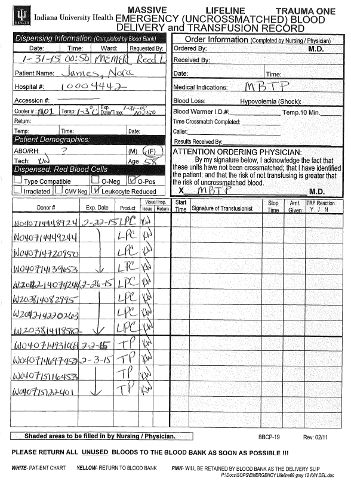
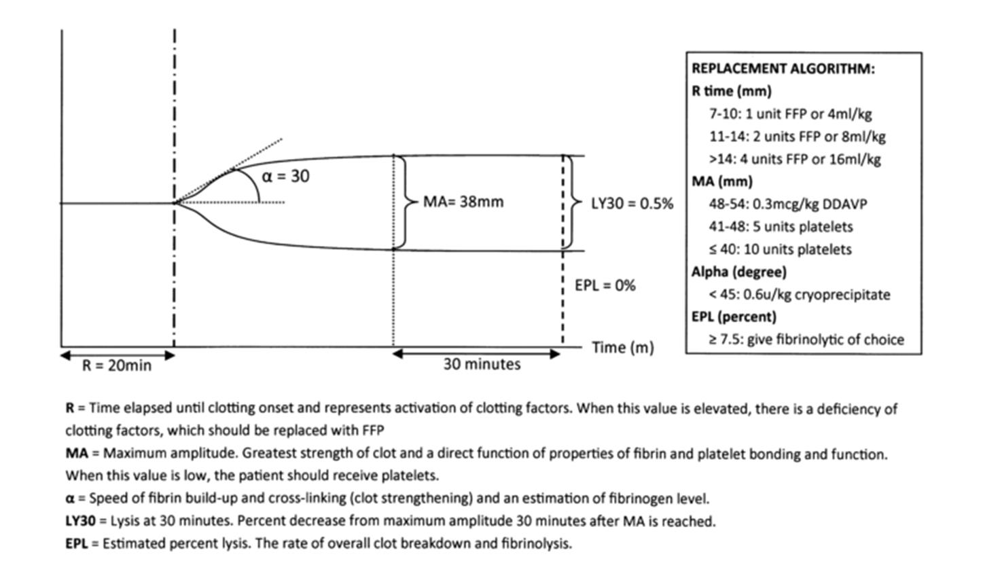

# Massive Blood Transfusion Protocol (MBTP) Methodist Hospital - Adults

## PURPOSE
- To provide procedures for early activation and management of the Massive Blood Transfusion Protocol (MBTP). The MBTP is a protocol designed to provide significant volumes of uncrossmatched red cells, platelets, plasma, and cryoprecipitate for efficient, effective, and expedited treatment of massive blood loss.
- This document addresses:
    - The process for activating and deactivating the MBTP
    - Specific steps to ensure rapid availability of blood components to the ordering practitioner
    - Key issues to ensure the blood bank maintains an adequate supply of blood components to support MBTP activations.
    - Steps to limit blood component wastage.
    
## SCOPE
- This protocol is available to all physician service providers responsible for the care patients experiencing massive blood loss at Methodist Hospital.
    
## EXCEPTIONS
None
    
## DEFINITIONS
- Apheresis Platelet: 
    - Also known as a single donor platelet that is equivalent to 6 – 8 pooled random donor platelets in plasma.
- Cryoprecipitate (CRYO): 
    - A plasma component that, through a freeze/thaw process, contains a concentrated source of fibrinogen, coagulation factor VIII, coagulation factor XIII, vonWillebrand factor (vWF), and fibronectin.
- Incompatible Blood: 
    - Donor blood that has been found incompatible either serologically or electronically with the patient’s sample.
- Leukoreduced Packed Red Blood Cells (LPC): 
    - Red blood cells (RBC, also called erythrocytes) that have been collected, processed, and stored in bags as blood product units available for blood transfusion. In processing the number of white blood cells (WBC) is reduced by specialized filters and components collected through apheresis devices to meet the current standards of leukocyte depletion, that is, \< 5 × 10 6 WBC/unit of blood component.
- Massive Blood Transfusion (MBT): 
    - Transfusion of 10 or more Red Blood Cell (RBC) components within 24 hours, or transfusion of 5 or more RBC units within 4 hours.
- Mismatched Blood: 
    - Donor blood that is a major mismatch with the patient’s blood type: (for example: Group A Rh positive donor RBCs transfused to Group O Rh positive patient)
- Plasma: 
    - the fluid portion of the circulating blood that contains coagulation factors and is used to treat coagulopathy. Plasma is named according to the way it is processed.
    - Thawed Plasma (TP): 
        - Frozen plasma that has been thawed, is relabeled as Thawed Plasma, and may be stored at 1-6°C for up to 5 days. TP is the plasma type available at IU Health Blood Banks.
- Premenopausal Females: 
    - For the purposes of this protocol, premenopausal females are defined as women who are 50 years old or less.
- TEG (Thromboelastography): 
    - A lab test performed in the blood bank that measures the viscoelastic properties of whole blood as it clots as a way to determine the efficiency to determine specific defects of blood coagulation.
    - TEG Platelet Mapping (TEG-PM): 
        - Assesses degree of platelet inhibition secondary to antiplatelet medication therapy.
    - TEG Functional Fibrinogen Assay(TEG-FF): 
        - Determines the contribution of fibrinogen to clotting to identify hypofibrinogenemia or dysfibrinogenemia.
- Transfusionist: 
    - Individual(s) transfusing the patient.
- Type-compatible Blood: 
    - Donor blood that is not identical to the patient’s blood type, but is compatible for transfusion (for example: Group O Rh positive donor RBCs transfused to Group A Rh positive patient).
- Type-specific Blood: 
    - Donor blood that is the identical blood type of the recipient.
- Uncrossmatched Blood: 
    - Donor blood that has not been crossmatched either serologically or electronically with the patient’s sample. 
       
## Protocol Statements
- The MBTP may be activated by the treating physician or their designee when it is anticipated that the patient will require the **rapid infusion** of massive volumes (usually greater than 10 units) of blood and blood components.
- The MBTP must be deactivated by the treating physician or their designee once it has been determined that the urgent need for blood has been managed.
- The treating physician or their designee shall contact the Methodist Hospital Blood Bank (MHBB) to activate the MBTP at **962-3555**.
- The blood bank shall maintain adequate inventory in house to insure that type-specific and/or type-compatible blood components are made available in a timely manner.
- The blood bank shall coordinate with blood suppliers to maintain inventory of blood components.
- Group O Rh Positive Leukoreduced Packed Red Cells (LPC) will be issued if the Patient’s Blood Type is unknown or when a current blood sample is not available.
     - Exception: If inventory permits, Group O Negative LPCs will be issued to pre-menopausal females with unknown or a historically Rh Negative blood type.
- Rh Negative Females who are at least 51 years of age and Rh Negative Males will be issued Rh positive LPCs unless inventory of Rh negative components is large enough to permit the exclusive use of Rh negative blood components.
- It is an expectation that a blood sample for type and screen will be sent to the MHBB at the earliest possible time (usually within 15 minutes) in order to provide type specific rather than universal donor type compatible components.
- Group AB Plasma will be issued for the first three doses of the MBTP if the patient’s blood type is unknown. In order to protect the AB plasma supply, the type and screen blood sample must be received and resulted by the BB before the fourth and subsequent doses of plasma are prepared for the patient.
- **Uncrossmatched**, Type-Specific or Type-Compatible LPCs will be issued to expedite the provision of LPCs.
    - Serologic or Electronic crossmatches will be performed retrospectively. The treating physician or their designee will be notified immediately if incompatible units were issued by the Blood Bank.
- The Blood Bank Physician will consult with the treating physician or their designee, when the inventory of compatible (type-specific or type-compatible) blood is in danger of being depleted for use in the system.
    - Discussion must occur between the Blood Bank Physician and the treating physician or their designee regarding the use of mismatched blood components.
    - Discussion must occur between the Blood Bank Physician and the treating physician or their designee regarding the use of incompatible blood components.
- To expedite the provision of blood components, special component processing such as CMV negative, Fresh, Washed, HLA matched, Antigen Matched and/or Irradiated blood will not be provided.
- The patient service area shall arrange for pick-up and delivery of transport coolers to and from the blood bank.
- LPCs and Plasma shall be packed and stored in transport coolers packed with wet ice to maintain storage temperature and minimize product wastage.
- Leukoreduced Apheresis Platelets (LAPL) and CRYO shall be maintained at ambient temperature. DO NOT refrigerate or place these components in transport coolers.
- A dose of CRYO will be thawed only when ordered.

## Protocols
- The treating physician or their designee calls the Methodist Hospital Blood Bank (MHBB) to activate the MBTP.
- An order for Massive Blood Transfusion Protocol is entered into the EMR for electronic signature.
    - If the EMR is down, the order may be entered retrospectively with the dates and time corrected.
- Send Type and Screen sample to MHBB as soon as possible.
- The Blood Bank Medical Technologist (BBMT) prepares each dose at a 2:1 red cell to plasma ratio. Each dose shall contain 8 LPCs, 4 Plasmas, and 1 LAPL
    - LPCs and Plasma will be placed in transport coolers for pick-up. LAPLs are kept at ambient temperature.
    - The BBMT shall complete the following items on form BBCP-19 (See Example Form 1, 3 part form) to document the units being issued.
        - Dispensing Information
        - Patient Demographics
        - Component, ABO type, and donor number of units issued
        - Ordering MD
    - Form BBCP-19, completed with dispensing information as above, is sent with the units and will be used to document the transfusions.
- The treating physician or their designee receives the units and documents the following on the BBCP-19:
    - Received by
    - Date
    - Time recieved
- The transfusionist completes the transfusion section of the BBCP-19. See Form 1 for an example.
- Once the MBTP is activated the treating physician or their designee should immediately send a transportation assistant to the Blood Bank to obtain the first dose (supply).
- After a dose/cooler is retrieved, the next anticipated dose will be prepared until the protocol is deactivated.
- If a Type and Screen specimen has not been received in the blood bank, each time that a prepared cooler/dose is picked up the BBMT will call to remind the service area that a Type and Screen blood specimen is still needed.
- AB plasma will not be prepared for the 4 th and subsequent doses until a type and screen specimen has been received and tested in the blood bank.
- Pooled CRYO equivalent to 10 units may be ordered as needed. If CRYO has not been ordered by the time the third dose is in preparation, the BBMT will query the treating physician to confirm an intention to omit CRYO.
- Additional 4 packs of plasma and/or unit of platelets or CRYO may be requested if indicated based on TEG, TEG-PM, or TEG FF results, respectively. Add-on units will be tubed at the practitioner’s request.
- The coolers will be labeled with numbers that correspond with utilization.
- The treating physician or their designee notifies BBMT to deactivate the protocol when appropriate.
- The BBMT will confirm continuation of MBTP activation if a prepared cooler is not retrieved within 45 minutes of the time the previous cooler was delivered.
- After deactivation of the protocol, the BBMT will call the service area the results of the retrospective compatibility testing.
- IU Health blood bank management will notify the on-call Transfusion Medicine physician within 72 hours if an Rh negative female less than 51 years old has been transfused with Rh positive red cells. The on-call Transfusion Medicine physician will be responsible for discussing possible therapeutic options for preventing Rh alloimunization with the treating physician.

## Cross References
EMTC 678.90010 - Pediatric MBTP BBTSP-4

## REFERENCES/CITATIONS
- Dirks J, Jorgensen H, Jensen CH, et al. Blood product ratio in acute traumatic coagulopathy – effect on mortality in a Scandinavian level 1 trauma centre. *Scandinavian Journal of Trauma, Resuscitation and Emergency Medicine*. 2010 Dec 7;18:65.
- Chambers LA, Chow SJ, Shaffer LET. Frequency and characteristics of coagulopathy in trauma patients treated with a low- or high-plasma-content massive transfusion protocol. *Am J Clin Pathol*. 2011 Sep;136(3):364-370.
- Inaba K, Branco BC, Rhee P, et al., Impact of plasma transfusion in trauma patients who do not require massive transfusion. J Am Coll Surg. 2010 Jun;210(6):957-65.
- Riskin DJ, Tsai TC, Riskin L, et al., Massive transfusion protocols: the role of aggressive resuscitation versus product ratio in mortality reduction. *J Am Coll Surg*. 2009 Aug;209(2):198-205
- Harr JN, Moore EE, Ghasabyan A, et al. Functional fibrinogen assay indicates that fibrinogen is critical in correcting abnormal clot strength following trauma. *Shock*. 2013 Jan;39(1):45-9.
- Holcomb JB, Wade CE, Michalek JE, et al. Increased plasma and platelet to red blood cell ratios improves outcome in 466 massively transfused civilian trauma patients. *Ann Surg*. 2008 Sep;248(3):447-58.
- Malone DL, Hess JR, Fingerhut A. Massive transfusion practices around the globe and a suggestion for a common massive transfusion protocol. *J Trauma*. 2006 Jun; 60(6 Suppl):S91-6.
- Ketchum L, Hess JR, Hiippala S. Indications for early fresh frozen plasma, cryoprecipitate, and platelet transfusion in trauma. *J Trauma*. 2006 Jun;60(6 Suppl):S51-8.
- Holcomb JB, Jenkins D, Rhee P, et al. Damage control resuscitation: directly addressing the early coagulopathy of trauma. *J Trauma*. 2007 Feb;62(2):307-10.
- Hirshberg A, Dugas M, Banez E, Scott B, Wall M, Mattox K. Minimizing dilutional coagulopathy in exsanguinating hemorrhage: A computer simulation. *J Trauma*. 2003 Mar;54(3):454–461.
- Holcomb J, Minei K, Cotton B, et al. Admission rapid thrombelastography can replace conventional coagulation tests in the emergency department: experience with 1974 consecutive trauma patients. *Annals Of Surgery* [serial online]. 2012 Sep; 256(3):476-486.
- Johansson PI, Stensballe J, Oliveri R, et al. How I treat patients with massive hemorrhage. *Blood Journal*. October 2014:124:3052-3058. doi: 10.1182/blood-2014-05-575340
- Reed RL, 2nd, Ciavarella D, Heimbach DM, et al. Prophylactic platelet administration during massive transfusion. A prospective, randomized, double-blind clinical study. Ann Surg 1986; 203:40-48.
- Pohlman, T.H., Walsh, M., Aversa, J., Hutchison, E.M., Olsen, K.P., Reed, R.L. “Damage Control Resuscitation.” *Blood Rev*. 2015 (In press).
- Zatta AJ, McQuilten ZK, Mitra B, et al. Elucidating the clinical characteristics of patients captured using different definitions of massive transfusion. *Vox Sang*. July 2014; 107(1):60-70.

## FORMS/APPENDICES
- Form 1: Example of completed Emergency Blood Delivery and Transfusion Record (form BBCP-19)
- Table 1: Quick Reference to TEG Results.

## Responsibility for Protocol
- Each activation of the MBTP for traumatic injury will generate an automatic audit by Trauma Service for process improvement.
- Responsible parties:
    - IUH Director of Transfusion Medicine
    - IUH MH Director of Trauma Services
    - IUH MH Director of Level One Vascular Emergency Program
    - IUH MH Director of Emergency Medicine & Trauma Center
    
## Protocol Review Body
Indiana University Health Transfusion Committee  
Director of Clinical Transfusion Medicine

## Protocol Review Signatures
- Lawrence Reed, MD  
  Trauma Medical Director
- Michael Dalsing, MD  
  Co-Director of Vascular Emergency Program
- Charles Shufflebarger, MD  
  Director of Emergency Medicine and Trauma Center
- Daniel Smith, MD  
  Director of Transfusion Medicine
  
## Dates
Approval Date:      January, 2010  
Effective Date:     January 12, 2010  
Updated:            October, 2010  
Updated:            September, 2011  
Updated:            January, 2015  

### Form 1: Example of Completed Form BBCP-19

### Table 1: Quick Reference to TEG Results

From: Tapia NM, Chang A, Norman M, Welsh F, Scott B, Wall MJ, Jr., et al. TEG-guided
resuscitation is superior to standardized MTP resuscitation in massively transfused penetrating
trauma patients. *J Trauma Acute Care Surg* 2013;74:378-85.
