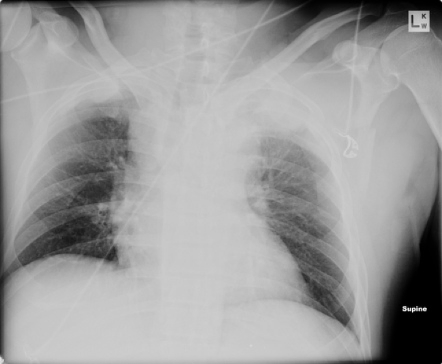

## Management of Blunt Aortic Injuries

Injury to the aorta has contributed to death following MVC in 10-15% of cases but blunt aortic injury occurs in episodes of rapid deceleration regardless of mechanism.  The proximal descending aorta is involved in 54-65% of cases.  The mechanism of injury is most commonly attributed to shear forces generated between the mobile portion of the vessel and the fixation point at the ligamentum arteriosum.  Injury may also be caused by compression of the vessel between bony structures or by a profound hypertensive episode at the time of injury.  The severity of injury may range from a pseudoaneurysm to a full-thickness rupture.

*Diagnosis*  
In addition to history, initial physical exam and radiologic studies may raise suspicion of a blunt injury to the thoracic aorta.

##### Physical Exam
- Hemodynamic instability
- Unequal blood pressure or pulse exam in the upper extremities
- Evidence of major chest trauma : flail chest, sternal fracture, and expanding 
- Hematoma of the thoracic outlet

##### Chest Xray
- Large hemothorax
- Widened mediastinum
- Blunting of the aortic knob
- Apical cap in the left chest

**Angiography**  
The gold standard for diagnosis of blunt aortic injuries is CT-angiography.  With the current high quality of computed tomography, interventional angiography is no longer required for diagnosis, though may be utilized for treatment.

##### Management
- ABC’s
    - The patient should be resuscitated initially according to standard ATLS protocols.
    - Large bore intravenous access is mandatory and there should be a low threshold for central venous access.
- Control of blood pressure and heart rate
    - The use of beta-blockade is considered standard in patients with blunt aortic injuries, however, there is some variation in management.  This should be discussed with the consulting services.  The goal is to decrease the risk of fatal rupture due to ‘blow-out’ from hemodynamic stress from elevated heart rate and blood pressure.
    - Exact goals for MAP and HR may vary depending on the consulting vascular or cardiothoracic surgeon.  Safe goals include a heart rate less than 80 and a MAP less than 70.
    - Arterial blood pressure monitoring is mandatory.  A radial arterial line should be placed on the right.
- Consultation for management
    - Vascular surgery and cardiothoracic surgery should be consulted. 
    - A majority of blunt aortic injuries are now managed via endovascular techniques.  An awareness of post-operative complications related to stent graft placement is necessary for the surgeon caring for these injuries.  The various types endograft leak may be reviewed at:
    - <a href="http://www.uptodate.com/contents/complications-of-endovascular-abdominal-aortic-repair">http://www.uptodate.com/contents/complications-of-endovascular-abdominal-aortic-repair</a>
- ICU admission
    - Patients should be monitored closely in the intensive care unit.
