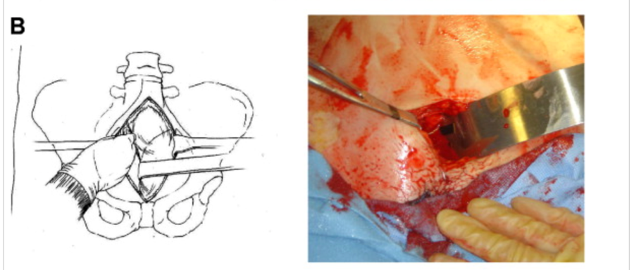

## Damage Control Principles 

Some of the most complete discussions of damage control surgery are found in the military combat Clinical Practice Guidelines.  The information in this section was taken from <u>Combat Casualty Care : Lessons Learned from OEF and OIF,</u> Chapter 5: Damage Control Surgery (Eastridge etal).

#### Major Principles
- Rapid control of hemorrhage
- Rapid control of contamination
- Packing and temporary closure of surgical site
- Resuscitation to include:
    - Avoidance of hypothermia
    - Correction of coagulopathy via 1:1 resuscitation
    - Correction of acidosis

#### Resuscitative Thoracotomy
Survival is poor following resuscitative thoracotomy and strict guidelines should be followed to determine who is a candidate for this procedure.  In blunt trauma, a witnessed arrest in the trauma bay that is not from devastating head injury may be an indication.  For penetrating trauma, a witnessed arrest within 5-10 minutes of arrival to the trauma bay may be an indication.

- Steps for resuscitative thoracotomy
	1. A generous incision is made from the sternum to the table in the 5th intercostal space.  Care should be taken to retract the breast upward in female patients and not to divide the nipple.  The incision should be taken down to the chest wall using the taken down to the chest wall using the knife.
	2. A large Metzenbaum scissors is used to open the intercostal musculature, staying directly above the rib.  This incision is made with a ‘pushing’ stroke of the scissors.
    3. The rib spreader is placed with the handle towards the bed.  The chest is opened widely.
    4. The inferior pulmonary ligament should be divided to allow mobilization of the lung out of the field.  Care should be taken to avoid excessive division leading to injury to the pulmonary vasculature.
    5. The pericardium is grasped between clamps and sharply opened on the diagonal (to avoid injury to the phrenic nerve) to relieve any tamponade.  Ongoing  hemorrhage should be controlled with:
        - Direct pressure
        - A Foley catheter
        - Surgical staples
        - A stitch
        - Care must be taken to avoid injury to the coronary vessels
    6. The aorta is compressed with a clamp or manually.
    7. Any obvious sources of intra-thoracic hemorrhage are addressed.
    8. If necessary, open cardiac massage or defibrillation may occur.
- Hilar Twist – This maneuver has been advocated for control of major hemorrhage from the  pulmonary vasculature.  There is a high-associated mortality.  If hilar clamping is necessary, it should be accomplished slowly to allow the remaining lung to accommodate and to prevent right heart failure.

#### Damage Control Laparotomy
This concept is well-understood.  Abdominal closure may be accomplished in many ways that include an abdominal negative pressure dressing (wound vac), sterile cassette cover with chest tubes or NGT’s for drainage, Wittmann Patch or even skin closure accomplished with penetrating towel clamps.

- May vascular injuries of the abdomen can be surgical challenges.  The principles of proximal and distal control remain.  In cases which a ‘bail-out’ procedure is required, options include:
    - Temporary vascular shunts
    - Schrock shunt
    - Pelvic packing with embolization
    - Supra-celiac aortic occlusion
    - Total vascular isolation of the liver
    - Ligation
  	
Complete discussion of these techniques is beyond the scope of this manual, but references are readily available in the literature.

- Injuries to the Pancreas and Duodenum represent a particular challenge and often require many trips to the OR.  The distal pancreas may be safely resected while major injuries to the head of the pancreas should be widely drained while full characterization of the injury occurs and operative planning is completed in a semi-urgent fashion.
- Duodenal injuries should be repaired primarily if this will not result in significant narrowing of the lumen.  Tenuous repairs or significant tissue destruction may require pyloric exclusion, placement of triple tubes (gastrostomy tube, proximal j-tube for drainage, distal j-tube for feeding).
    - Pancreaticoduodenectomy for trauma should be reserved for grade V injuries.

#### Pelvic Packing

- Pelvic fracture resulting in hemodynamic instability should be initially treated with a pelvic binder or tightly bound sheet to allow for tamponade.
- Interventional radiology is a useful adjunct in cases of pelvic hemorrhage from an arterial source.  This remains the standard of care in most cases of relatively stable patients with contrast extravasation due to pelvic fracture.
- In cases of hemodynamic instability or if IR is unable to control hemorrhage, pelvic packing is pursued.
    - Burlew CC etal.  “Preperitoneal Pelvic Packing/External Fixation with Secondary Angioembolization: Optimal Care for Life-Threatening Hemorrhage from Unstable Pelvic Fractures.” *J Am Coll Surg* 2011; 212(4):628-37.

 

 

- Much like with an open abdomen, patients must return to the OR within 2-3 days for unpacking.  The pelvis may be repacked if necessary but this significantly increases the risk of subsequent pelvic sepsis.

#### Vascular Damage Control
- Should be pursued when the patient is in extremis, is demonstrating signs of acute traumatic coagulopathy or as a temporizing measure which orthopedic stabilization occurs.
- Where a concomitant venous and arterial injury occur, both vessels may be shunted to allow later repair.  Limb salvage rates are better when venous injuries are reconstructed in addition to arterial repair.
- An appropriately sized shunt should be chosen to match the caliber of the vessel. Options include:
    - Argyle or Javid shunts (commonly used in carotid endarterectomies)
    - Sterile IV tubing
    - Small chest tubes (especially appropriate for venous injuries
- If properly placed, shunts may remain patent for days and do not require heparinization.
- Techniques for proper shunt placement include:
	1. Pass a Fogarty catheter proximally and distally to remove any residual thrombus.
	2. Trim the shunt to a proper length.  There should be 2-3 cm overlap with the native vessel.  Shunts that are too long may abut bifurcations, which will impede outflow.
	3. When the shunt is placed, secure the native vessel to the shunt with silk ties.
	4. It is often helpful to tie a silk suture around the mid-portion of the shunt.  This will help with manipulation and prevent the shunt from migrating down-stream and becoming irretrievable.
- Tourniquets are very helpful in the pre-hospital setting to control hemorrhage until surgical control can be obtained.
