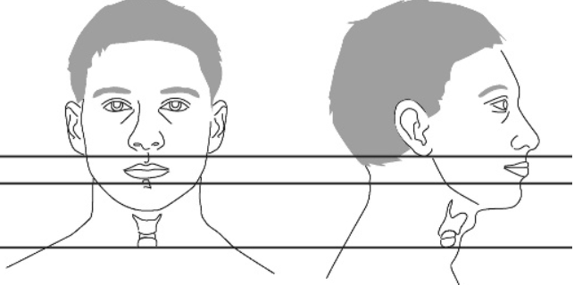

# Injuries to the Neck

## Hard/Soft signs of injury
- Active bleeding
- Palpable thrill
- Audible bruit
- Hemoptysis, hematemesis
- Dysphonia / hoarseness / stridor
- Widened mediastinum on CXR
- Pulsatile, expanding hematoma
- Cranial nerve deficits

## Zones of the neck and anatomic considerations, exposures

### Zone I - Thoracic inlet (clavicles to cricoid cartilage)
- Considerations
    - Apices of pleura, distal esophagus, thoracic duct
    - Common caratid, subclavian vessels, vertebral arteries
    - Brachial plexus
- Exposure
    - Prep face, ear, anterior and lateral neck, supraclavicular and chest (consider prepping groin/ankle for saphenous vein)
    - Median sternotomy - right subclavian, right CCA, proximal veins
    - Left anterior thoracotomy 2nd/3rd interspace - left subclavian, left CCA for proximal control then a direct supraclavicular approach for repair
- Management
    - Vascular injuries in this region are often amenable to angiography

### Zone II - Mid neck (cricoid cartilage to angle of mandible)
- Considerations
    - Trachea, larynx, esophagus, thyroid, salivary glands
    - Common/internal/external caratid
    - Vagus nerve, recurrent laryngeal nerve
- Exposure
    - Prep face, ear, anterior and lateral neck, supraclavicular and chest (consider prepping groin/ankle for saphenous vein)
    - Unilateral exploration - anterior boarder of SCM
    - Bilateral exploration - low collar incision, 1-2cm above clavicular heads

### Zone III - Skull base (angle of mandible to base of skull)
- Considerations
    - Pharynx, parotid gland
    - Distal internal carotid artery, vertebral arteries
    - Cranial nerves
- Exposure
    - Prep face, ear, anterior an dlateral neck, supraclavicular and chest (consider prepping groin/ankle for sapenous vein)
    - Specific to injury
        - TMJ disarticulation
        - Division of strap muscles
        - Excision of styloid process
