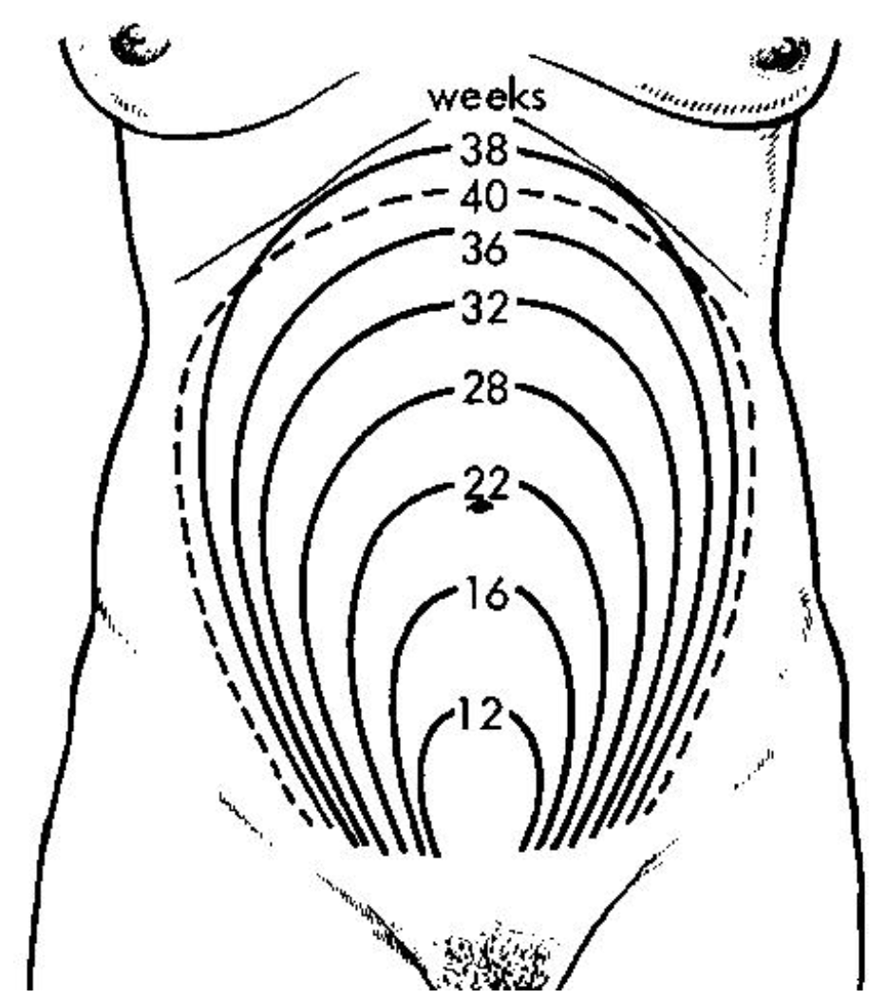

# Management of the Pregnant Trauma Patient

## Introduction
Trauma has become the most frequent cause of maternal death in the United States of America. And, the number of maternal deaths due to penetrating trauma, suicide, homicide and motor vehicle accidents has risen steadily. Accidental injuries occur in 6 to 7% of all pregnant patients.

Although the initial assessment and management priorities for resuscitation of the injured pregnant patient are the same as those for other traumatized patients, the specific anatomic and physiologic changes that occur during pregnancy may alter the response to injury and hence necessitate a modified approach to the resuscitation process. The main principle guiding therapy must be that resuscitating the mother will resuscitate the fetus.

## Fetal Physiology
- Depends on gestational age of fetus.
- Fetal survival depends upon adequate uterine perfusion and oxygen delivery. Disruption of these systems resulting from maternal shock may result in fetal survival as low as 20%.
- Fetal response to impaired perfusion may include bradycardia or tachycardia, a decrease in the baseline variability of the heart rate, the absence of normal accelerations in the heart rate, or recurrent decelerations.
    - Abnormal fetal heart rate may be the first indication of distress. The secondary survey of the pregnant trauma patient should include auscultation of heart tones.

## Maternal Physiology

### <u>Cardiovascular</u>
- Increased cardiac output and blood volume by 30-40% by 28 weeks gestation.
- Up to 40% of maternal blood volume may be lost prior to signs of shock.
- Susceptible to hypotension and signs of shock due to aortocaval compression.
- **Left uterine displacement is mandatory in patients in advanced pregnancy to avoid hypotension and injury to the mother and fetus.**

### <u>Thoracic/Respiratory</u>
- Diaphragm may rise up to 4cm from displacement by uterus. Chest enlarges by 2cm, substernal angle increases by 50%.
- Decreased functional residual capacity (FRC) noted during pregnancy : 2 nd trimester has 20% decrease in FRC with 20% increase in oxygen consumption.
- Patients may rapidly desaturate during periods of apnea or airway obstruction.

### <u>Gastrointestinal</u>
- Inhibited gastrointestinal motility due to elevated progesterone and estrogen.
- Decreased competency of gastroesophageal sphincter, increased potential for aspiration.
- Displacement of intraabdominal contents by gravid uterus.

### <u>Renal</u>
- Renal blood flow increases by 25-50%, BUN and serum creatinine are reduced.
- Hypertrophy and hyperemia of kidneys as early as 10 th week of gestation.

### <u>Neurologic</u>
- Neurologic changes result in decreased tolerance to anesthestic. Loss of consciousness may occur at ‘sedative’ doses.

## The Pregnant Trauma Patient
The primary initial goal in treating a pregnant trauma victim is to stabilize the mother&#39;s condition. The priorities for treatment of an injured pregnant patient remain the same as those for the nonpregnant patient.

### <u>Primary Survey</u>
- Standard ABC’s with mother taking priority over the fetus.
- Supplemental oxygen is encouraged to prevent maternal and fetal hypoxia.
- Lateral displacement of the uterus after 20 weeks gestation.
- Pregnant patients may be significantly hypovolemic without obvious manifestations. Suspicion should remain high.

### <u>Secondary Survery</u>
- Complete history, including an obstetrical history, physical examination and evaluation and monitoring of the fetus.
- Include the date of the last menstruation, expected date of delivery and any problems or complications of the current and previous pregnancies.
- Determination of the uterine size provides an approximation of gestational age, i.e. measurement of fundal height is a rapid method for estimating fetal age.
- Fetal age determines viability. If the fundus extends past the uterus, fetus is potentially viable.
- Pelvic and rectal examinations should be performed.
- Rule out vaginal bleeding, ruptured membranes, a bulging perineum, the presence of contractions, and an abnormal fetal heart rate and rhythm.
- All Rh-negative mothers who present with a history of abdominal trauma should receive one 300-ug prophylactic dose of Rh immune globulin (anti-D immunoglobulin; Rhogam) within 72 hours of the traumatic event.

### <u>Fetal Assessment</u>
- Start with checking fetal heart rate and noting fetal movement. The normal range for the fetal heart rate is 120 to 160 beats/minute.
- Use of continuous fetal heart rate monitoring permits prompt identification of the fetus at risk for asphyxia and fetal death.
- Premature labor affects up to 25% of patients beyond 22 weeks gestation.
- All fetuses greater than 24 weeks gestation should be monitored for at least 6 hours after trauma.
- Monitoring should continue for 24 hours if there are signs of contractions or signs of abdominal trauma.

### <u>Diagnostic Modalities/Radiation Exposure</u>
- Sensitivity to radiation is greater during intrauterine development in the first trimester. Although there is much concern about radiation exposure, a diagnostic modality deemed necessary for maternal evaluation should not be withheld on the basis of its potential hazard to the fetus.
- The major effects of exposure include congenital malformations, growth retardation, postnatal neoplasia, and death.
- Studies show that exposure of the fetus to less than 5 to 10 rad (5000 to 10000 mrad) causes no significant increase in the risk of congenital malformations, intrauterine growth retardation, or miscarriage.
- Shield the maternal abdomen when possible.

### <u>Perimortem Cesarean Delivery</u>
- For pregnant patients in extremis, if there is no response to advanced cardiac life support within a few minutes (2 to 3 minutes), maternal cardiopulmonary resuscitation must be continued, anterior thoracotomy with open-chest cardiac massage (OCM) but without aortic cross-clamping should be considered.
- Emergency cesarean section for a viable fetus should be performed.

