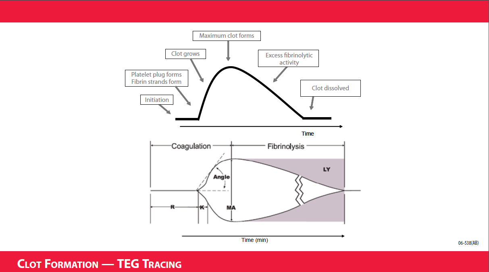
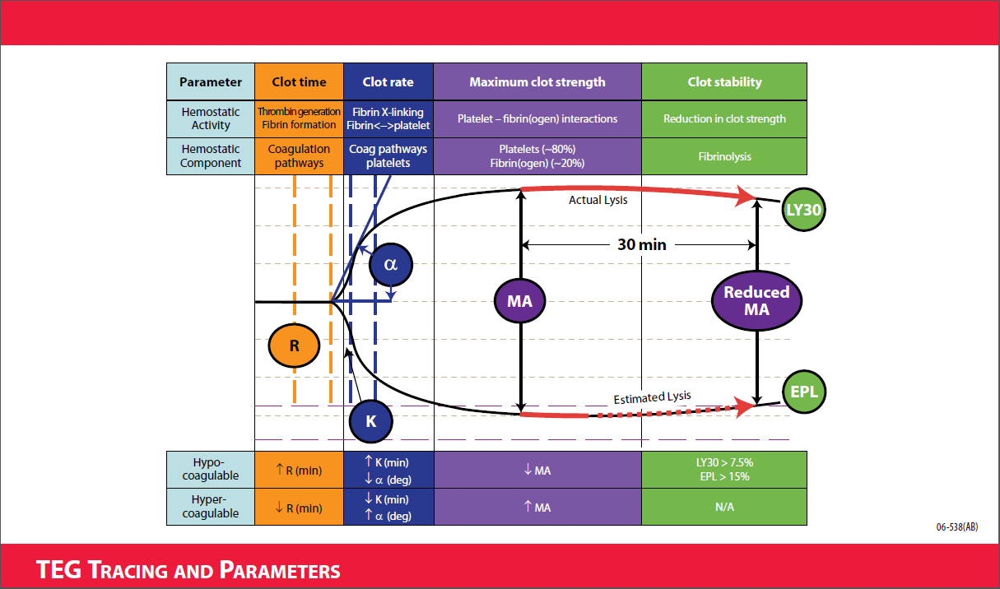
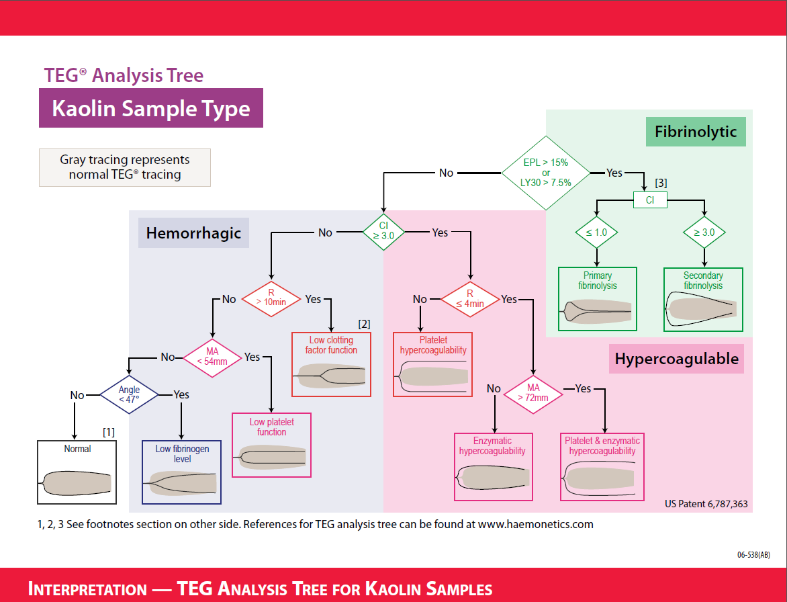

## TEG Interpretation and Treatment Guide

##### For Expert Interpretation Contact Dr. Tim Pohlman or <a href="tel:1-800-438-2834">1-800-GET-A-TEG</a>

<a href='#' class='btn'>Click to view analysis tree interactivity</a>

 

<b>Treatment Guide</b>
 
 
<b>Footnotes from TEG Analysis Tree below</b>

- Normal results may be obtained for a bleeding patient. If normal TEG results are obtained and patient is bleeding:
    - **Rule out Von Willebrand factor dysfunction**—Clot formation may be normal, but clot may not adhere to the damaged vascular site due to poor platelet-to-subendothelial bonding.
    - **Rule out Antiplatelet drugs**—Use PlateletMapping assays to measure the effect of antiplatelet therapy.
    - **Mechanical bleeding**—If vWF deficiency and antiplatelet drugs have been ruled out, consider surgical bleeding.
- Increase R values in a kaolin (K) sample are seen when heparin is present. Comparing a kaolin (K) sample with heparinase (KH) sample from the same blood sample will demonstrate the effect of heparin.
- If the C.I. is greater than 1.0, but less than 3.0, the clinician should assess individual TEG parameters, hemostasis results, and the patient’s clinical conditions before determining if the patient is in a state of primary or secondary fibrinolysis. Additional samples may be of use.

#### Additional Notes
<b>Heparinase cups:</b> If plain and blue cup samples were run and patient is not heparin treated, it is advised to evaluate coagulopathy based on the plain cup sample to more closely match in vivo conditions.  
 
<b>Hypothermia:</b> if the patient post op is hypothermic, a split sample may be run: one sample at the patient’s body temperature and a second sample at 37°C.  
 
<b>Rewarming samples:</b> Values in the analysis tree are based on kaolin activated samples run at  

<table class="tg">
  <tr>
    <th class="tg-hpat">TEG Value</th>
    <th class="tg-hpat">Hemostasis State</th>
    <th class="tg-hpat">Common Treatment</th>
  </tr>
  <tr>
    <td class="tg-i0og"><b>R</b> less than 4 min</td>
    <td class="tg-031e">Enzymatichyper coagulability</td>
    <td class="tg-031e">Anticoagulant of choice</td>
  </tr>
  <tr>
    <td class="tg-031e"><b>R</b> between 11-14 min</td>
    <td class="tg-031e">Low clotting factors</td>
    <td class="tg-031e">X2 FFP or 8ml/kg, iCa&gt;1.2,correct acidosis &amp; hypothermia</td>
  </tr>
  <tr>
    <td class="tg-yw4l"><b>R</b> greater than 14 min</td>
    <td class="tg-yw4l">Very low clotting factors</td>
    <td class="tg-yw4l">X4 FFP or 16ml/kg, iCa&gt;1.2,correct acidosis &amp; hypothermia</td>
  </tr>
  <tr>
    <td class="tg-yw4l"><b>MA</b> between 46-54mm</td>
    <td class="tg-yw4l">Low platelet function</td>
    <td class="tg-yw4l">DDAVP 0.3 mcg/kg IVPB ,consider platelets</td>
  </tr>
  <tr>
    <td class="tg-yw4l"><b>MA</b> between 41-45mm</td>
    <td class="tg-yw4l">Very low platelet function</td>
    <td class="tg-yw4l">X5 platelet units ±DDAVP 0.3 mcg/kg IVPB</td>
  </tr>
  <tr>
    <td class="tg-yw4l"><b>MA</b> at 40mm or less</td>
    <td class="tg-yw4l">Extremely low platelet function</td>
    <td class="tg-yw4l">X10 platelet units ±DDAVP 0.3 mcg/kg IVPB</td>
  </tr>
  <tr>
    <td class="tg-yw4l"><b>MA</b> greater than 73mm</td>
    <td class="tg-yw4l">Platelet hypercoagulability</td>
    <td class="tg-yw4l">Antiplatelet therapy</td>
  </tr>
  <tr>
    <td class="tg-yw4l"><b>R</b> less than 4 min and <b>MA</b> greater than 73mm</td>
    <td class="tg-yw4l">Enzymatic and platelet Hypercoagulability</td>
    <td class="tg-yw4l">Antiplatelet therapy andanticoagulant of choice</td>
  </tr>
  <tr>
    <td class="tg-yw4l"><b>Angle</b> less than 45°</td>
    <td class="tg-yw4l">Low fibrinogen level</td>
    <td class="tg-yw4l">0.06 u/kg cryo</td>
  </tr>
  <tr>
    <td class="tg-yw4l">LY30 at 7.5% or greater, <b>CI</b> less than 1.0</td>
    <td class="tg-yw4l">Primary fibrinolysis</td>
    <td class="tg-yw4l">Tranexamic acid 1 gm IVPB or Aminocaproic acid 5 gm IVPB</td>
  </tr>
  <tr>
    <td class="tg-yw4l">LY30 at 7.5% or greater, <b>CI</b> less than 3.0</td>
    <td class="tg-yw4l">Secondary fibrinolysis</td>
    <td class="tg-yw4l">Consider heparin</td>
  </tr>
  <tr>
    <td class="tg-yw4l">LY30 less than 7.5%, <b>CI</b> less than 3.0</td>
    <td class="tg-yw4l">Prothrombotic state</td>
    <td class="tg-yw4l">Consider heparin</td>
  </tr>
</table>
<a href='#' class='btn'>Click to view table interactivity</a>
