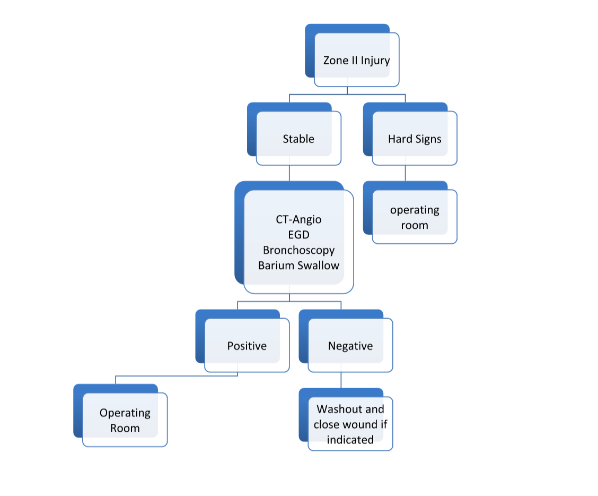

# Zone II Penetrating Neck Injuries

Concepts: penetrating injuries that violate the platysma muscle are considered deep. Zone II is the area between the cricoid cartilage and the angle of the mandible.

Key anatomy
- Jugular veins
- Vertebral and common carotid arteries
- External and internal carotid arteries
- Esophagus
- Spinal cord
- Larynx

### Evaluation of Injuries
Hard Signs: Proceed directly to OR for exploration
- Active hemorrhage
- Pulsatile/expanding hematoma
- Active air leak from wound

### <u>Surgical Considerations</u>
Position: Head extended and rotated to contralateral side. Use a shoulder roll. Prep in the chest and groin.
Achieve hemorrhage control with direct pressure.

<u>**Incision:**</u>Along the anterior border of the sternocleidomastoid muscle in the “ trail of safety” from the mastoid process to the sternal notch, if necessary.
1. Divide the platysma.
2. Free the anterior border of the platysma and identify the internal jugular vein (the most commonly injured vessel in the neck). Avoid the vagus nerve posteriorly and the hypoglossal nerve on the proximal internal carotid.
3. Find and ligate the facial vein to gain access to carotid bifurcation.
4. Expose the cervical esophagus by dissecting medial to the carotid sheath. Be sure to insert large bore NGT and remember it is slightly to the left of the midline. Retract the carotid sheath structures laterally. Consider diving the omohyoid muscle, middle thyroid vein, inferior thyroid artery. Insufflate air to facilitate identification of injury.

### <u>Specific Injuries</u>
Jugular Vein:
- Repair with 5-0 prolene or ligate if the injury is complex

Carotid Artery
- Proximal control with Rummel tourniquet
- Be sure to perform thrombectomy and use heparinized saline, #3 fogarty
- Shunt if duration of ischemia or stability is a concern
- Primary repair or resection with primary repair in simple injuries
- Use conduit (vein, bovine pericardium)
- Interposition graft for large injuries
- Ligate as a last resort.

Esophagus
- Debride the injury to healthy edges
- Approximate the mucosa without tension using 1 or 2 layers (3-0 PDS)
- Protect suture line with flap if there are other repairs in proximity
- Bail out with controlled esophageal fistula

Larynx and Trachea
- Repair small injuries with interrupted 3-0 PDS
- ENT consult for more devastating injuries
- ET tubes or tracheotomy are the bail out options.
